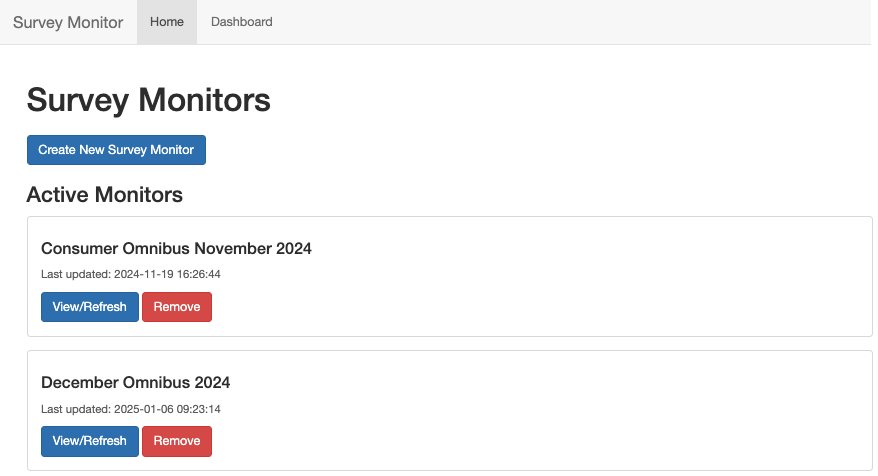
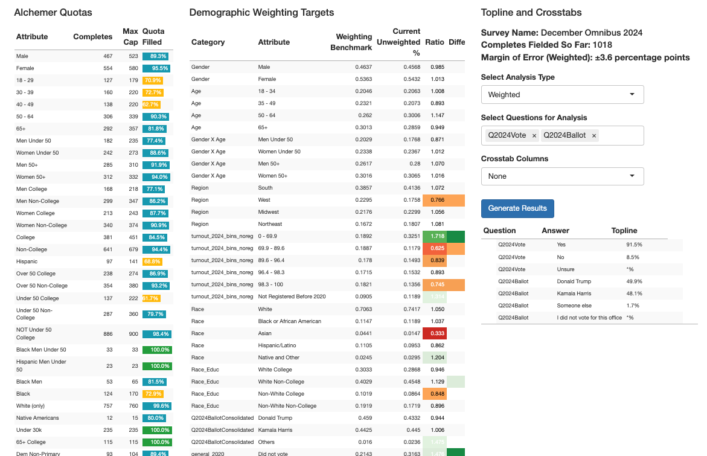

# Live Survey Monitor

This is a full-stack interactive analytics dashboard for monitoring and analyzing live polling data in SPSS (sav format). 

## Instructions and Features

1. All live surveys currently in field are listed on the homepage.
2. You can either click on an existing survey or create a new survey. This navigates you to the dashboard panel.
3. If you created a new survey, you'll input the realtime data export link (or the raw file itself), a weights csv file, and the Alchemer survey number (to retrieve quota info).
4. Click refresh data, and everything runs automatically from there.
     - The app retrieves the file from the realtime export, matches respondents to internal voter file database (NOT public),
       does cleaning+processing+aligns names with the weights csv, runs statistical weights (to align survey sample with population benchmarks),
       and then outputs three tables: one table containing progress on demographic quotas, a second table displaying color-coded comparisons of raw sample to weighting benchmarks,
       and a final interactive section where users can output the current (weighted or unweighted) results to any question they want.

## Tech Stack
R Shiny (containing HTML, CSS, JavaScript code), deployed with Docker and AWS.

## Screenshots

### Homepage

### Dashboard Table Layout

